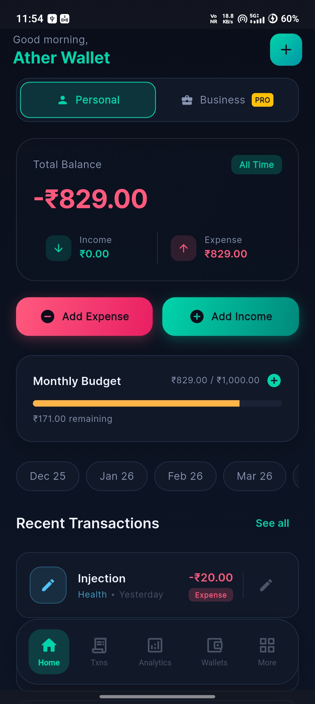
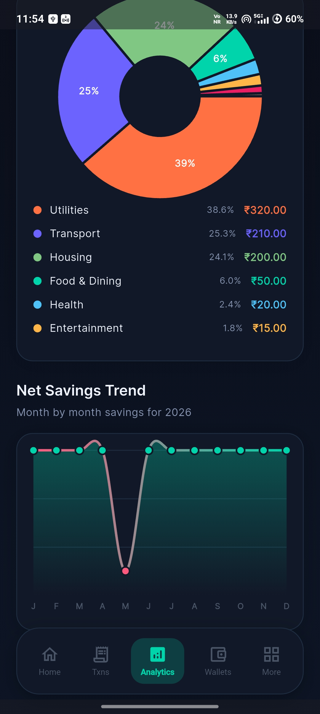
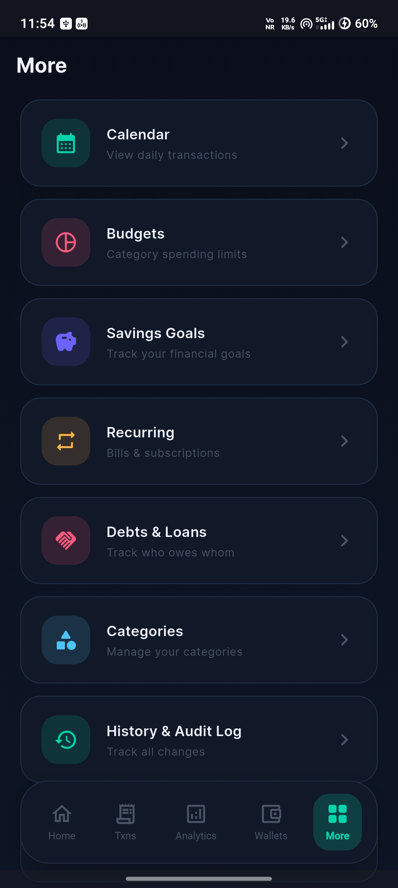
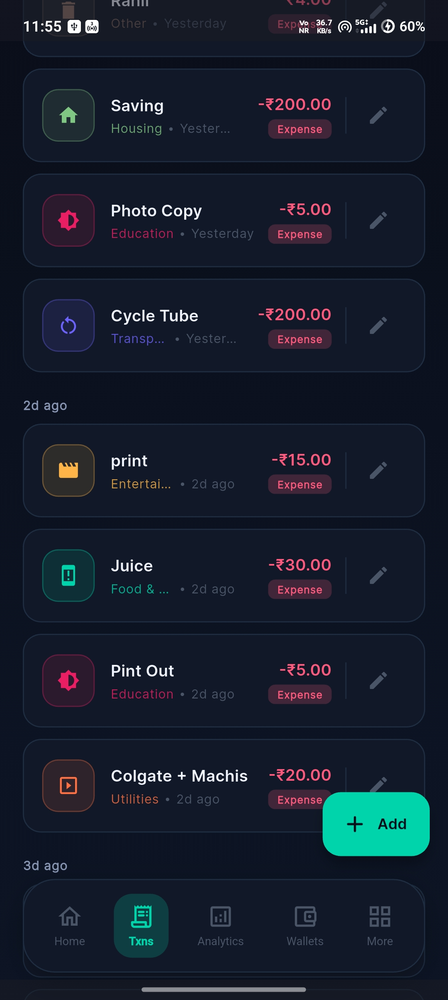

<h1 align="center">
  <br>
  Finance Tracker
  <br>
</h1>

<h4 align="center">A comprehensive, offline-first personal finance tracking app built with Flutter.</h4>

<p align="center">
  <a href="https://flutter.dev">
    
  </a>
  <a href="https://dart.dev">
    
  </a>
  <a href="https://opensource.org/licenses/MIT">
    
  </a>
</p>

<p align="center">
  <a href="#-key-features">Key Features</a> •
  <a href="#-screenshots">Screenshots</a> •
  <a href="#-how-to-use">How To Use</a> •
  <a href="#-tech-stack">Tech Stack</a> •
  <a href="#-support-the-project">Support</a>
</p>

---

## 📱 Screenshots

<div align="center">
  
  
  
  
</div>

## ✨ Key Features

*   **💼 Multi-Wallet Balance Tracking:** Keep track of personal, business, and savings balances separately without mixing them up.
*   **📊 Budget Management:** Set monthly budget limits for different categories and visualize spending easily.
*   **🔄 Recurring Transactions:** Automate bills, subscriptions, and regular incomes to save time.
*   **📈 Detailed Analytics:** Dive deep into income/expense trends with intuitive charts and monitor your net savings over time.
*   **🔒 Privacy First & Offline:** Your financial data is securely stored locally on your device.
*   **💾 Data Import/Export:** Easily backup and restore your financial data across devices.
*   **🎨 Premium UI/UX:** A stunning dark-mode aesthetic built with glassmorphism and smooth animations.

## 🚀 How To Use

To clone and run this application, you'll need [Git](https://git-scm.com) and [Flutter](https://flutter.dev/docs/get-started/install) installed on your computer. From your command line:

```bash
# Clone this repository
$ git clone https://github.com/Developer-For-Git/Finance-Tracker.git

# Go into the repository
$ cd Finance-Tracker

# Install dependencies
$ flutter pub get

# Run the app
$ flutter run
```

## 🛠️ Tech Stack

- **Framework:** [Flutter](https://flutter.dev/)
- **Language:** [Dart](https://dart.dev/)
- **Architecture:** MVVM/Clean Architecture
- **Local Storage:** SQLite (Offline-first approach)

## 💖 Support the Project

If you find this project useful and want to support its continued development, consider donating! Scan the QR code below:

<div align="left">
  
</div>

---
<p align="center">Made with ❤️ for the community</p>
